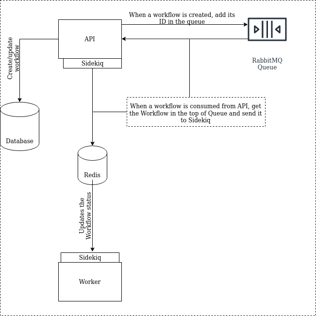
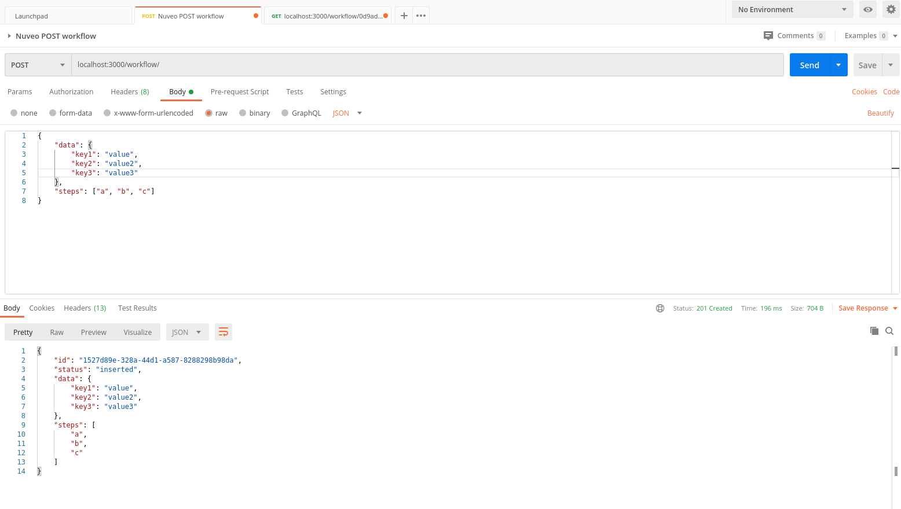
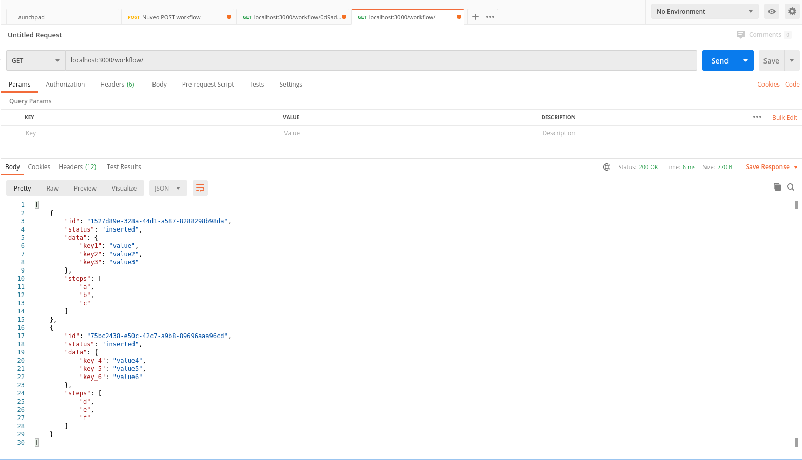
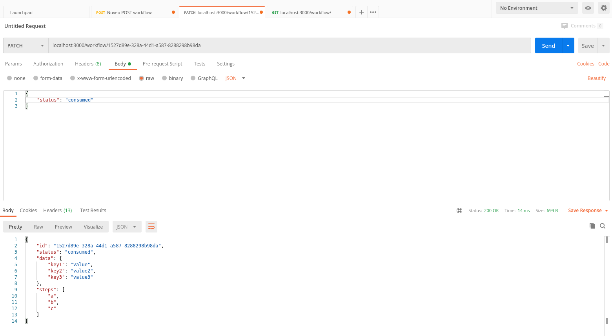
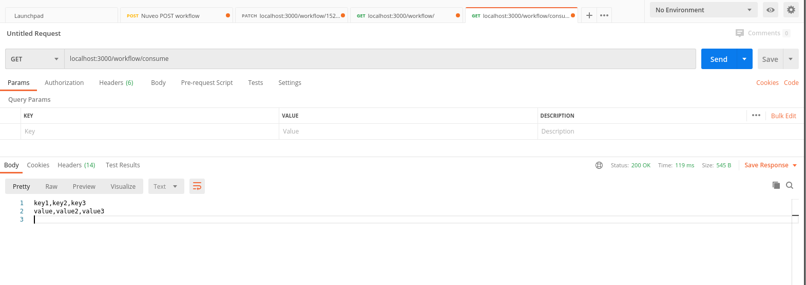
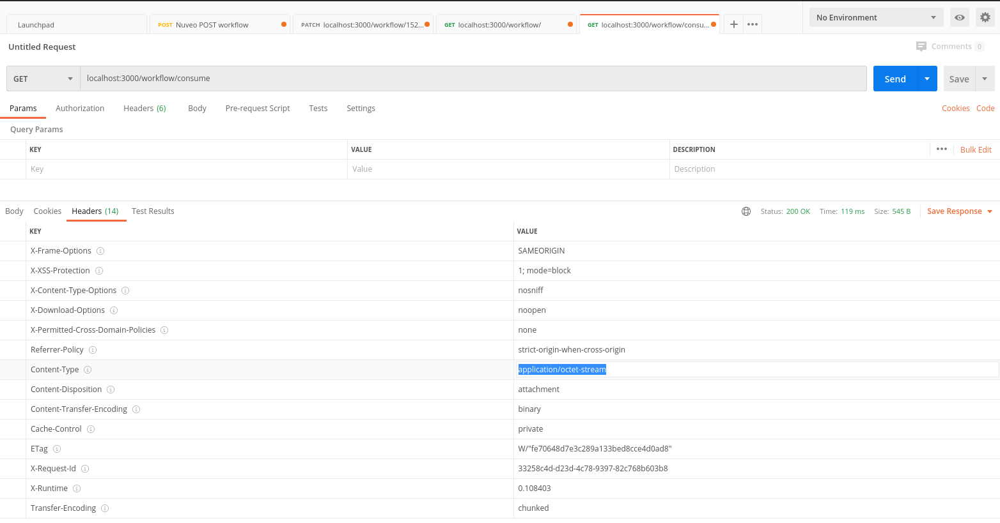
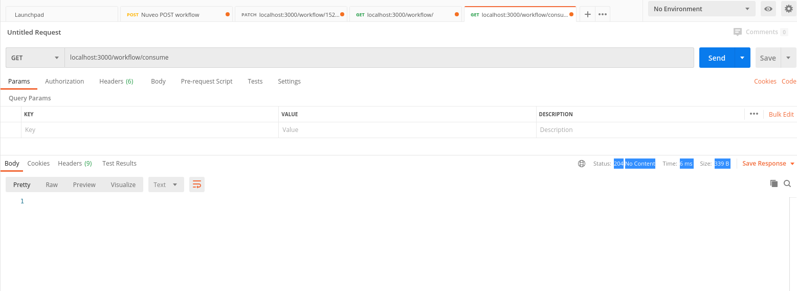

# Walter's Nuveo backend challenge

### Overview

This project contains an assessment to a backend rola at Nuveo. Even having some minor experiences working with Golang(as you can check some code [here](https://github.com/walteraa/nginx-fic)), I decided to code this challenge by using rails, since is the main language I've been working with in the past few years. Basically, the stack I've choose was:

- Language and framework: Ruby on Rails;
- Database: Postgress;
- Background job processing: Sidekiq;
- Background job processing backend: Redis;
- Application queue: RabbitMQ;

> I've decided to work with RabbitMQ because it is a really simple Queue I've had experience in the past, plus, it has the Queue features I need to implement the challenge;

### Architectural overview

The application, consists basically on a REST API to insert and update the Workflow status, but we also have a RabbitMQ queue to add the workflow ID and this ID can be get when someone hits the `workflow/consume` route, then we can pop the Workflow in the top of the Queue, respond the `workflow.data` in the CSV format, and start a job to update the `workflow.status` from `inserted` to `consumed` asynchronously.

Here is simple archtecture image



### Running the application

First of all, you need to be in mind that this applications is running over Docker and docker-compose environment, then I am assuming you have docker and docker-compose properly installed and configured on your system. You just need to follow the steps below:

- Build the app image by running:
```
walter in ~/Workspace/nuveo/backend-test (master ✱) ➜  docker-compose build
db uses an image, skipping
gems uses an image, skipping
broker uses an image, skipping
redis uses an image, skipping
Building app_worker
Step 1/9 : FROM ruby:2.6.3-slim
2.6.3-slim: Pulling from library/ruby
1ab2bdfe9778: Pull complete
99a8cced404d: Pull complete
cbdb421da845: Pull complete
4c74d75d085a: Pull complete
70558c94bd82: Pull complete
Digest: sha256:2ea700aecad636d74b851b4ad1f94bd7045ce94099f19095564b451fa107b02e
Status: Downloaded newer image for ruby:2.6.3-slim
 ---> 1c75fac01180
Step 2/9 : RUN apt-get update -qq &&     apt-get install -y build-essential &&     apt-get install -y libpq-dev libxml2-dev libxslt1-dev nodejs chromium-driver
 ---> Running in 06cebe6bb0dd

(...)

Successfully built 02f358b16c13
Successfully tagged backend-test_app:latest
```

- After build the image, you gonna be able to start the containers, it probably will require you to pull some other base images, such as Redis, Postgres and Rabbitmq:
```
walter in ~/Workspace/nuveo/backend-test (master ✱) ➜  docker-compose up 
Creating volume "backend-test_db" with default driver
Creating volume "backend-test_gems" with default driver
Pulling db (postgres:9.6)...
9.6: Pulling from library/postgres
cbd31ae33279: Pull complete
0cf130beb85d: Pull complete
7834350bdbbd: Pull complete
094d0f760202: Pull complete
2037bc17ee04: Pull complete
7aaa063845bf: Pull complete
ac9a0b4aa30c: Pull complete
e13ca55ff349: Pull complete
24ece2e831f0: Pull complete
810aa5b83d76: Pull complete
2bfcde4af945: Pull complete
2930194d58a8: Pull complete
e20920535390: Pull complete
3d50aa4ef2a2: Pull complete
Digest: sha256:6ad3692e8987b039c11a2bca5af447acadbe00f91b230d9a6ac793870705df23
Status: Downloaded newer image for postgres:9.6
Pulling gems (busybox:)...

(...)

```
You only gonna be allowed to use the app, when all the gems(dependencies) gonna be installed from the app and you can see the output above:

```
app_1         | Created database 'app_development'
app_1         | Created database 'app_test'
app_1         | Puma starting in single mode...
app_1         | * Version 4.3.5 (ruby 2.6.3-p62), codename: Mysterious Traveller
app_1         | * Min threads: 5, max threads: 5
app_1         | * Environment: development
app_1         | **************************************************
app_1         | ⛔️ WARNING: Sidekiq testing API enabled, but this is not the test environment.  Your jobs will not go to Redis.
app_1         | **************************************************
app_1         | * Listening on tcp://0.0.0.0:3000
app_1         | Use Ctrl-C to stop
```

Then, let's play around the application!!

### Using the application

For showing that, I gonna use Postman as HTTP client, but feel free to use any other you wish.

#### The workflow POST

To create a Workflow, you just need to POST the workflow data and steps array to the URL http://localhost:3000/workflow/ as you can see in the image below



You can check that we send as response body, the representation of the Workflow.

#### The workflow List

To get a JSON array of all wofklows in the system, you just need to send a GET request to the URL http://localhost:3000/workflow/, then you can see all workflows in the system as you can see in the image below



> To make the test fast and simplier, I've didn't added pagination params neither filters for that, even it being not so difficult by using pagination gems, it could increase the complexity and the timing to delivery the test, because if I added that, I should create also some tests and examples here.

#### Updating the status

To update a Workflow status, we need to PATCH by using the URL http://localhost:3000/workflow/{WORKFLOW_UUID}



In that case, we gonna receive as response a new representation of the Workflow, by having the new status.

> It is important to know that, even we adding that Workflow in the queue to be processed when `workflow/consume` route is accessed, I've decided to skip already consumed workflows in the CSV generation and the Sidekiq Workflow update. Plus, I decided also to add the Workflow again in the queeu it is updated from consumed to inserted.

#### Consuming workflow

For that, we can see that by GET from http://localhost:3000/workflow/consume we gonna receive a attachment file representing the CSV of the `workflow.data` at the top of the Queue with the inserted status.

 


You can check in the headers we gonna download a CSV file



If the queue is empty, you gonna receive a 204 (No content) status code without any data.




### Running tests

To run the tests, you basically need to perform the following command:

```
walter in ~/Workspace/nuveo/backend-test/app/views (master ✱) ➜  
docker-compose run --rm app bundle exec rspec
Starting backend-test_broker_1 ... done
Starting backend-test_db_1     ... done
Starting backend-test_gems_1   ... done
[rspec-sidekiq] WARNING! Sidekiq will *NOT* process jobs in this environment. See https://github.com/philostler/rspec-sidekiq/wiki/FAQ-&-Troubleshooting
........................

Finished in 0.20922 seconds (files took 1.12 seconds to load)
24 examples, 0 failures
```

It gonna perform the models, requests, jobs and routing tests added.


### Difficulties

I've had some difficulties to understand what should I do with the steps Array(it is not clear in the descrption) and also if I should add again a workflow in the queue if the status was updated from consumed to inserted, for this last, I assumed that I should.
